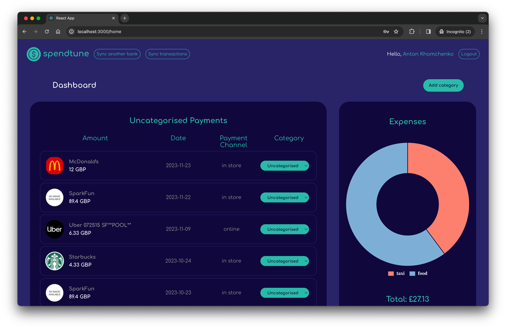

# SpendTune — Minimalistic personal expense tracker

This is the fork of [original project](https://github.com/Kamil-Zmuda/SpendTune-Solo-Project/) by [Kamil Zmuda](https://github.com/Kamil-Zmuda/).

## Screenshots

<p align="center">
  
</p>


## Getting started

1. Clone the repo

```
git clone https://github.com/Kamil-Zmuda/SpendTune-Solo-Project.git
cd SpendTune-Solo-Project
```

---

This application is integrated with Plaid's open banking API which is used to authorize and connect the user with their banking institutions.

Plaid's API offers many products however for app needs I'm using 'transactions' to fetch and sync them. Follow these steps:

To configure the API it's necessary to register an account at:
      https://dashboard.plaid.com/signup

Now go to your dashboard and select Developers => Keys section

Here you will find your client_id and Secret keys.

Go to projects ROOT/server and create a `.env` file, make sure to add this file to your .gitignore list, as it will store some sensitive data you don't want to expose.

Populate the `.env` file:
- PLAID_CLIENT_ID= client_id from Plaid's dashboard
- PLAID_SECRET=secret key from Plaid's dashboard
- PLAID_ENV=sandbox <= here you specify your environment - sandbox mode allows to fetch mock data from Plaid's mock institutions, so you don't need to worry about leaking your real data.
- PLAID_SANDBOX_REDIRECT_URI=http://localhost:3001 <= redirect URI for server
- SERVER_PORT=3001
- SECRET="spendTune"

Now go to your dashboard and select Developers => API section.

Here you need to specify allowed Redirect URIs, same as above in the `.env` file.

Now you're good to go.

---

2. Setup and run the server:

- Install and run `MongoDB` process;
- Install dependencies:
```bash
cd server
npm i
```
- Run the server:
```bash
npm run dev
```

3. Setup and run the client:
- Install dependencies:
```bash
cd client
npm i
```
- Run the client:
```bash
npm run dev
```

Open [http://localhost:3001](http://localhost:3001) with your browser to see the result.

## Built with
#### Frontend
* [Typescript](https://www.typescriptlang.org/) - Strongly typed programming language that builds on JavaScript.
* [React](https://react.dev/) - Library for web and native user interfaces.
* [Zustand](https://docs.pmnd.rs/zustand/getting-started/introduction/) - State management solution.
* [JEST](https://jestjs.io/) - JavaScript testing framework.
* [Cypress](https://www.cypress.io/) - e2e testing tool.
* [Figma](https://www.figma.com/) - UI design tool entirely focused on user interface design.

#### Backend
* [Node.js](https://nodejs.org/en) - Open-source, cross-platform JavaScript runtime environment.
* [Express.js](https://expressjs.com/) - Unopinionated, minimalist web framework for Node.js.
* [MongoDB](https://www.mongodb.com//) - Document-oriented database program.
* [JEST](https://jestjs.io/) - JavaScript testing framework.

## Our contribution
1. Redesigned with Figma.
2. Created [GH Project page](https://github.com/users/khomch/projects/2) to manage tasks.
3. Rebuld app from Javascript to Typescript.
4. Created new layouts.
5. Split CSS using BEM methodology. 
6. Covered client and server with unit tests. 
7. Added e2e tests. 

## Authors

Juan Vasquez - [Github](https://github.com/simplyjuanc) - [LinkedIn](https://www.linkedin.com/in/juancvasquez/)
Anton Khomchenko - [Github](https://github.com/khomch) - [LinkedIn](https://www.linkedin.com/in/khomchenko/)


## License

This project is licensed under the MIT License.
